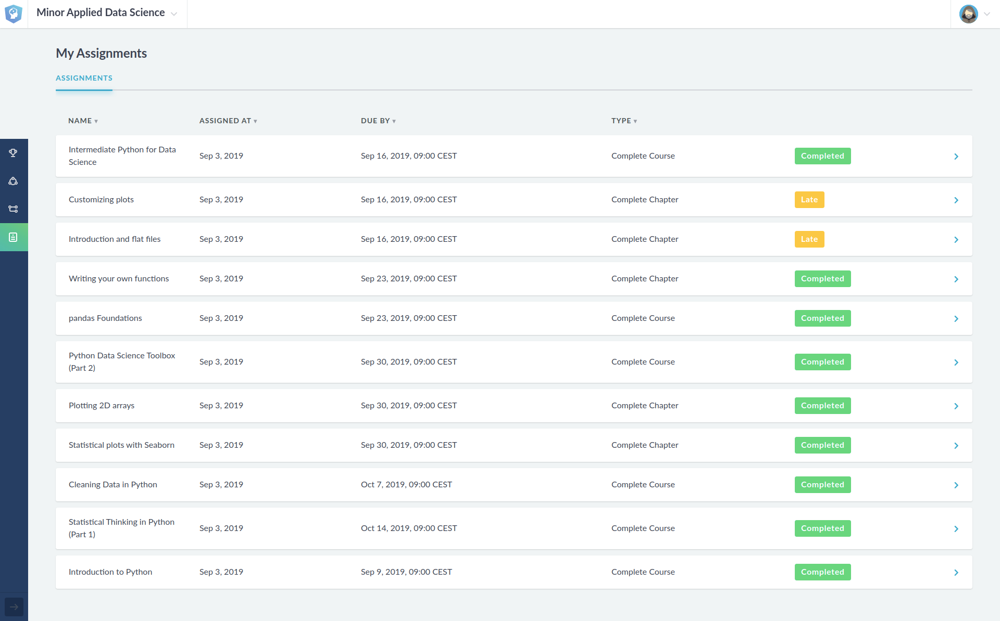

# Portfolio for Applied Data Science Minor

Welcome to the portfolio of Brice Lang-Nguyen,
 
This portfolio will describe all the activities that I participated in / did in the minor Applied Data science - KB74 (in the period from September 2019 to December 2019).
In this minor, I worked in a team of 7 fellow students and one teacher on a research project for the LUMC.

# Table of Contents
- [1. Self-development](#1-self-development)
    - [1. Datacamp](#11-datacamp)
        - [1. Assessments](#111-assessments)
        - [2. Projects](#112-projects)
- [2. Project introduction]()
    
# 1. Self-development

## 1.1. Datacamp

### 1.1.1. Assessments

### 1.1.2. Projects
- [Introduction to DataCamp Projects](./Datacamp/Projects/Introduction%20to%20DataCamp%20Projects/notebook.ipynb)
- [TV, Halftime Shows, and the Big Game](./Datacamp/Projects/TV,%20Halftime%20Shows,%20and%20the%20Big%20Game/notebook.ipynb)
- [The Github History of the Scala Language](./Datacamp/Projects/The%20GitHub%20History%20of%20the%20Scala%20Language/notebook.ipynb)
- [Exploring the Evolution of Linux](./Datacamp/Projects/Exploring%20the%20Evolution%20of%20Linux/notebook.ipynb)
- [Exploring 67 years of LEGO](./Datacamp/Projects/Exploring%2067%20years%20of%20LEGO/notebook.ipynb)