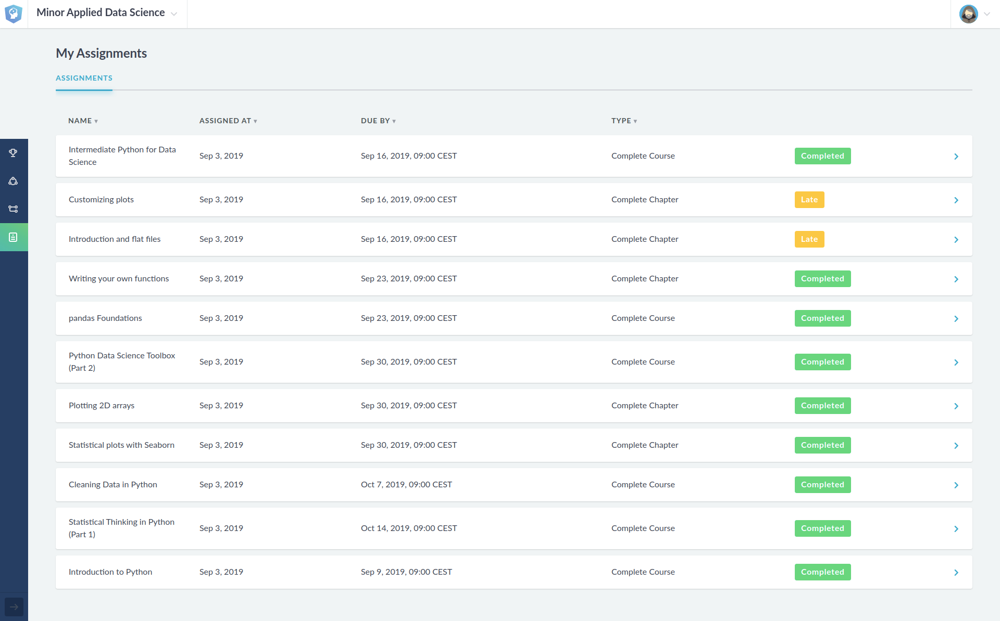
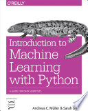
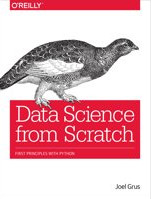
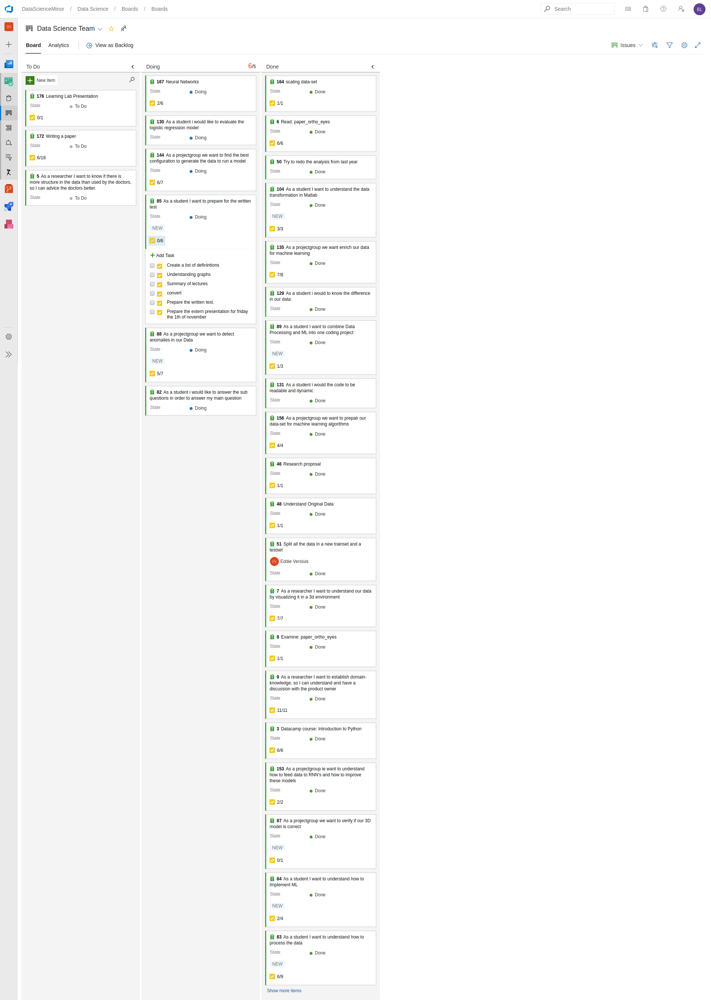
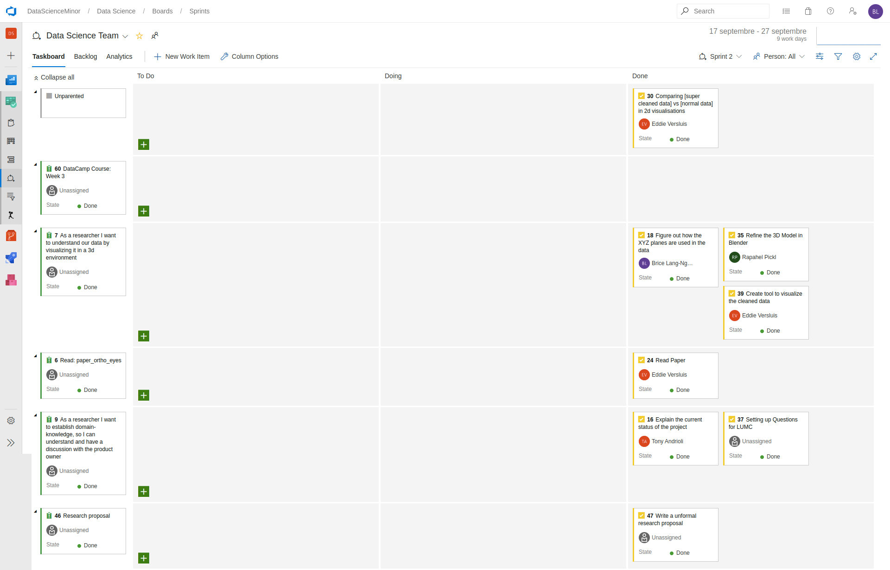
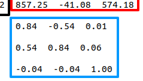
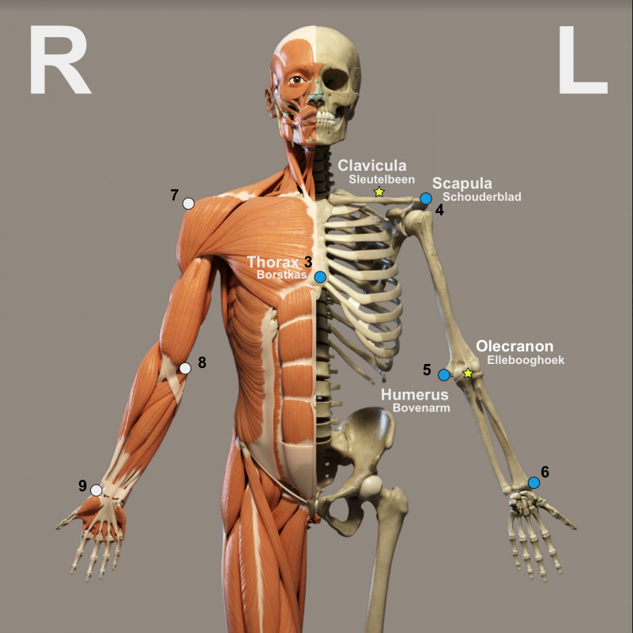

# Portfolio for Applied Data Science Minor

Welcome to the portfolio of Brice Lang-Nguyen,
 
This portfolio will describe all the activities that I participated in / did in the minor Applied Data science - KB74 (in the period from September 2019 to December 2019).
In this minor, I worked in a team of 7 fellow students and one teacher on a research project for the LUMC.

# Table of Contents
- [1. Self-development](#1-self-development)
    - [1. Datacamp](#11-datacamp)
        - [1. Assessments](#111-assessments)
        - [2. Projects](#112-projects)
    - [2. Books](#12-books)
- [2. Project Management](#2-project-management)
    - [1. Azure DevOps](#21-azure-devops)
- [3. Project](#3-project)
    - [1. Introduction](#31-introduction)
        - [1. Dictionary](#311-dictionary)
    
# 1. Self-development

## 1.1. Datacamp

At the begin of the 'Applied Data Science' course, we focused primarily on self-development, in particular self-development in the field of Python and machine learning by following the course of Datacamp. 

### 1.1.1. Assessments
 **Here is the progress of the Datacamp courses.**

### 1.1.2. Projects

I also decided to do some Datacamp projects.  
Most of them are focus on data manipulation and importing & cleaning data.   
Here is the list of the Datacamp projects:
- [Introduction to DataCamp Projects](./Datacamp/Projects/Introduction%20to%20DataCamp%20Projects/notebook.ipynb)
- [TV, Halftime Shows, and the Big Game](./Datacamp/Projects/TV,%20Halftime%20Shows,%20and%20the%20Big%20Game/notebook.ipynb)
- [The Github History of the Scala Language](./Datacamp/Projects/The%20GitHub%20History%20of%20the%20Scala%20Language/notebook.ipynb)
- [Exploring the Evolution of Linux](./Datacamp/Projects/Exploring%20the%20Evolution%20of%20Linux/notebook.ipynb)
- [Exploring 67 years of LEGO](./Datacamp/Projects/Exploring%2067%20years%20of%20LEGO/notebook.ipynb)

## 1.2. Books

-   
    *Introduction to Machine Learning with Python*  
    *Authors: Andreas C. Müller, Sarah Guido*
    
-   
    *Data Science from Scratch*   
    *Author: Joel Grus*
    
# 2. Project Management

To manage the project, we use the scrum method.

## 2.1. Azure DevOps
We decided to use Azure DevOps because we can use the Azure's Scrum Board and use the Azure's repository together. So, we can follow which commit is link to which task.

Here is a view of the scrum board (Click to show the picture) 

  

Here is a view of the tasks for the Sprint 2 (from 17th September to 27th September) (Click to show the picture) 

  

# 3. Project

## 3.1 Introduction

### 3.1.1 Dictionary

#### The 'Flock of Birds' system

The 'Flock of Birds' system is a magnetic tracking system that allow to track the bones of one person.
This system output a file with the coordinates of each bone and their rotation matrix.   
Here is an example of the data:   

- The number in the black square is the sensor number.
- The numbers in the red square are the position matrix.
- The numbers in the blue square are the rotation matrix.

All the sensor of the 'Flock of Birds' system are put in specific part of the body.
For this project, 7 sensors are used to follow the different bones of the upper body.    
Here is the position of the 7 sensors used, represent by the dots:

### Conversion made by the LUMC

The LUMC convert the output file of the 'Flock of Birds' system to a file that contain for each row the euler angles of each bones by following the Wu standard.
This standard is defined in the [Journal of Biomechanics 38 (2005) 981–992](./res/pdf/Wu%20et%20al%20J%20Biomech%2038%20(2005)%20981–992.pdf).

In this project, we used 3 types of data, here is the meaning:

| Term  | Meaning  |
|---|---|
| RAW Data | Data output by the 'Flock of Birds' system |
| Convert Data | Data after the conversion made by the LUMC |
| Cleaned Data | Data after the split of files that contains multiple times an exercise |

Different exercises:

| Term  | Meaning  | Visualisation  |
|---|---|---|
| AB  | Abduction  |   |
| AF  |   |   |
| EH  |   |   |
| EL  |   |   |
| RF  | Retroflection  |   |

## Split the data

We choose to split all the files that contains multiple times of one exercise.

To do this, I use the 3D Visualisation made by Raphaël and the visualisation of all the axis made by myself.

To do this, I made this for each files in the dataset:
- Use the 3D Visualisation of the raw file.
- Check If the movement is made more than 1 time:
    - If the movement is made more than 1 time:
        - Set the value of the column 'Contains multiple exercises' to 'YES'.
        - Use the visualisation of the euler axis to get the frame where we need to split the file.
    - If the movement is made 1 time:
        - Set the value of the column 'Contains multiple exercises' to 'NO'.

*Only the file named as AB, AF, EH, EL & RF
