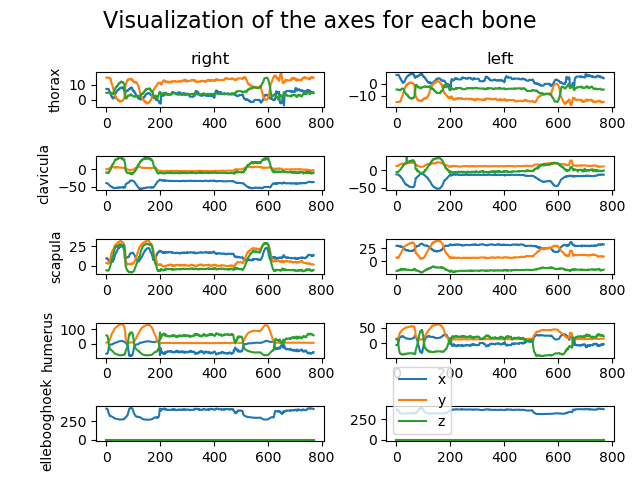

# Portfolio for Applied Data Science Minor

Welcome to the portfolio of Brice Lang-Nguyen,
 
This portfolio will describe all the activities that I did in the minor Applied Data science - KB74 (in the period from September 2019 to January 2020) at The Hague University of Applied Science.


     
In this minor, I worked in a team of 7 fellow students and one teacher on a research project for the LUMC.
The research report can be [found here](./res/pdf/).

# Table of Contents
- [1. Self-development](#1-self-development)
    - [1. Datacamp](#11-datacamp)
        - [1. Assessments](#111-assessments)
        - [2. Projects](#112-projects)
    - [2. Books](#12-books)
- [2. Project Management](#2-project-management)
    - [1. Scrum](#21-scrum)
    - [2. Azure DevOps](#22-azure-devops)
- [3. Project](#3-project)
    - [1. Introduction](#31-introduction)
        - [1. Dictionary](#311-dictionary)
            - [1. The 'Flock of Birds' system](#3111-the-flock-of-birds-system)
            - [2. Conversion made by the LUMC](#3112-conversion-made-by-the-lumc)
    - [2. Our research](#32-our-research)
        - [1. Figure out how the X,Y and Z planes are used in the data](#321-figure-out-how-the-xy-and-z-planes-are-used-in-the-data)
        - [2. Multiple exercises detection script](#322-multiple-exercises-detection-script)
        - [3. Split the data](#323-split-the-data)
        - [4. Convolutional neural network (CNN) - Data augmentation](#324-convolutional-neural-network-cnn---data-augmentation)
            - [Evaluation](#evaluation)
    - [3. Presentation](#33-presentations)
    
# 1. Self-development

## 1.1. Datacamp

At the begin of the 'Applied Data Science' course, we focused primarily on self-development, in particular self-development in the field of Python and machine learning by following the course of Datacamp. 
In the first weeks, 1 day a week was dedicated to the course on datacamp. Having already programmed in Python and having already used object-oriented programming with C++. I focused myself on learning the different libraries useful for learning machine learning (SKLearn and Tensorflow).

### 1.1.1. Assessments
      
**Here is the progress of the Datacamp courses:**


### 1.1.2. Projects

On Datacamp, you can find projects to train on machine learning techniques.  
I chose to do these projects to be able to improve my knowledge with the different libraries available with python like Pandas, Numpy, Matplotlib, etc.     
Most of them are focus on data manipulation and importing & cleaning data.   

**Here is the list of the Datacamp projects:**
- [Introduction to DataCamp Projects](./Datacamp/Projects/Introduction%20to%20DataCamp%20Projects/notebook.ipynb)
- [TV, Halftime Shows, and the Big Game](./Datacamp/Projects/TV,%20Halftime%20Shows,%20and%20the%20Big%20Game/notebook.ipynb)
- [The Github History of the Scala Language](./Datacamp/Projects/The%20GitHub%20History%20of%20the%20Scala%20Language/notebook.ipynb)
- [Exploring the Evolution of Linux](./Datacamp/Projects/Exploring%20the%20Evolution%20of%20Linux/notebook.ipynb)
- [Exploring 67 years of LEGO](./Datacamp/Projects/Exploring%2067%20years%20of%20LEGO/notebook.ipynb)

## 1.2. Books

I was led to read mainly, the following two books which were advised to me by Tony. I only read some chapters like Chapter 19 - Clustering of the book "Data Science from Scratch" or just the introduction of the book "Introduction to Machine Learning with Python".

-   
    *Introduction to Machine Learning with Python*  
    *Authors: Andreas C. Müller, Sarah Guido*
    
-   
    *Data Science from Scratch*   
    *Author: Joel Grus*
    
# 2. Project Management

## 2.1 Scrum

To manage this project, we used the Scrum framework.        
In addition to using Scrum as a management tool, we needed to find a research question that would serve as a common thread for our research.                  
In order to find a research question, we did some research and we all read the [research paper](https://github.com/Lukelumia/Applied-Data-Science/blob/master/paper_ortho_eyes.pdf) of the previous group. Then we discussed which direction the search should go in.               
We chose to create search sub-questions to use them as a guideline and avoid going off-topic.       
The selected research question can be [found here](#32-our-research)   


## 2.2. Azure DevOps
We decided to use Azure DevOps because we can use the Azure's Scrum Board and use the Azure's repository together. So, we can follow which commit is link to which task.
Using Azure's scrum board, we could assign tasks to team members and track the progress of the tasks.

<details><summary>Here is a view of the scrum board (Click to show the picture) </summary>
  
</details>

<details><summary>Here is a view of the tasks for the Sprint 2 (from 17th September to 27th September) (Click to show the picture) </summary>
  
</details>

# 3. Project

## 3.1 Introduction

### 3.1.1 Dictionary

#### 3.1.1.1 The 'Flock of Birds' system

The 'Flock of Birds' system is a magnetic tracking system that allow to track the bones of one person.
This system output a file with the coordinates of each bone and their rotation matrix.   
Here is an example of the data:   


- The number in the black square is the sensor number.
- The numbers in the red square are the position matrix.
- The numbers in the blue square are the rotation matrix.

All the sensor of the 'Flock of Birds' system are put in specific part of the body.
For this project, 7 sensors are used to follow the different bones of the upper body.    
Here is the position of the 7 sensors used, represent by the dots:


In this project, there are also terms used by the medical field, which can be seen below.
  
© WJEC CBAC LTD 2016 - [Website link](http://resource.download.wjec.co.uk.s3.amazonaws.com/vtc/2015-16/15-16_30/eng/06-pivotal-kick/Unit6-analysis-of-movement.html)

For this project, we need to keep in mind that the 'left' and 'right' are always used from the perspective of the patient. This is independent of the plane of the view.
So the right arm is always the arm that the patient considers to be 'his right arm'.

### 3.1.1.2 Conversion made by the LUMC

The LUMC convert the output file of the 'Flock of Birds' system to a file that contain for each row the euler angles of each bones by following the Wu standard.
This standard is defined in the [Journal of Biomechanics 38 (2005) 981–992](./res/pdf/Wu%20et%20al%20J%20Biomech%2038%20(2005)%20981–992.pdf).

### 3.1.1.3 The Dataset

In this project, we used 3 types of data, here is there meaning:

| Term  | Meaning  |
|---|---|
| RAW Data | Data output by the 'Flock of Birds' system |
| Convert Data | Data after the conversion made by the LUMC |
| Cleaned Data | Data after the split of files that contains multiple times an exercise |

At the beginning of the project, we had access to the dataset of the previous group. But after a few weeks, during the first appointment at LUMC, a researcher gave us the RAW dataset and the converted dataset with euler angles. So, that we could reproduce the steps done by the previous research group.

All of this data (RAW, Convert and Cleaned) are organized by patient categories which include patients and their exercises.
```shell script
# This is the path for the first AB exercise of the patient 1 of Category 2
Category_2/1/AB1.csv
```

### 3.1.2 Project status at the beginning of the course

At the begin of this minor, we had to read the research paper and understand what the previous group did.
The previous group did not know the name of the exercises. 

# 3.2 Our research

The purpose of this research is the following:
*To what extend and in what way, can different data science techniques be used on kinematic recordings to contribute to a valid and reliable diagnosis, made by a doctor, on Musculoskeletal Disorders.*

To achieve this research, we had at our disposal 2 types of dataset, RAW dataset and converted dataset.
With the converted dataset, we created a cleaned dataset.

## 3.2.1 Figure out how the X,Y and Z planes are used in the data


## 3.2.2 Multiple exercises detection script

The Notebook can be found [here](./res/notebooks/Multiple%20Exercises%20Detection.ipynb)    
The script can be found [here](https://dev.azure.com/DataScienceMinor/_git/Data%20Science?path=%2FMutlipleExercisesDetectionV2.py)

## 3.2.3 Split the data

Visualizing converted data showed several recordings contained more than one exercise.
We wanted each file to contain only one times of an exercise and not several. This allows to have more exercises to train the model. 
This led to the creation of a cleaning method for the dataset.

We choose to split all the files that contains multiple times of one exercise.

To do this, I use the 3D Visualisation made by Raphaël.
##### Here is a gif of the visualization:


In order to complete this task, I made a useful visualization which is able to display the 3 euler axes for each bone.
The script can be found [here](./res/scripts/VisualizeExercise.py).                         
You can find the notebook [here](./res/notebooks/Visualisation%20of%20all%20axis.ipynb).    

##### Here are a few examples with the command use and the output of the script: 
```shell script
python VisualizeExercise.py -f file/path.csv
```


```shell script
python VisualizeExercise.py -f file/path.csv --lift 25
```


```shell script
python VisualizeExercise.py -f file/path.csv --separator=0,90,90,200,470,635
```


To complete this task, I performed these steps for each file in the dataset:
- Use the [3D Visualisation](#here-is-a-gif-of-the-visualization) of the raw file.
- Check how many times the movement is made:
    - If the movement is made more than 1 time:
        - Set the value of the column 'Contains multiple exercises' to 'YES'.
        - Use the [visualisation](#here-are-a-few-examples-with-the-command-use-and-the-output-of-the-script) of the euler axis to get the frame(s) where we need to split the file and note in the excel sheet.
    - If the movement is made 1 time:
        - Set the value of the column 'Contains multiple exercises' to 'NO'.
- If the file contains some anomalies like the sensor ground moving or that the sensors have only been placed on one side of the individual, then write the observations in the 'Annotations' column.
- Finally, set the column 'Check' to 'YES'. This is just to track where we are in the file check.

Here is the [result in Excel format](./res/sheet/Patients.xlsx).  
*Only the files of the AB, AF, EH, EL & RF exercises were checked

Before the split, we had:   

| Category no. | Number of exercises |
|--------------|---------------------|
| 1 | 298 |     
| 2 | 216 |
| 3 | 184 |
| 4 | 291 |


After the split, we had:    

| Category no. | Number of exercises |
|--------------|---------------------|
| 1 | 299 |
| 2 | 397 |
| 3 | 362 |
| 4 | 292 |

By splitting the files, the number of exercises for categories 2 and 3 was almost doubled.
This allowed us to be sure that the model is fill with 'normalized' data, i.e. the model can focus on finding the differences between the different groups of patients by presenting them with data that are in the same format, i.e. one exercise per file.

## 3.2.4 Convolutional neural network (CNN) - Data augmentation

In addition to validating the results of the previous group, we started looking for another technique of machine learning. We chose to explore what convolutional neural networks (CNN) could do with our dataset.

Hassan was working on that task and he was faced with a overfitting problem with his model.
He asked me to help him to implement some data augmentation techniques.
We chose to use data augmentation techniques to fix the overfitting issue because the dataset was too small to be use with a Convolutional neural network.

The goal of data augmentation is to increase the amount of data by using techniques like cropping, padding, flipping, etc.
Data augmentation makes the model more robust to slight variations, and hence prevents the model from overfitting.

Before going any further, we transform the exercises with euler angles to pictures like this:  


Before implementing data augmentation in the project. I made a small script to understand how it's works and in what way we can implement those techniques.

The script can be found [here](./res/scripts/data_augmentation.py)          
The notebook can be found [here](./res/notebooks/Data%20Augmentation%20-%20CNN.ipynb)

### Script results:
#### Original image:


#### Generated images:


Here is the code used for the CNN (Code extracted from the file [dataAug.py](./res/scripts/dataAug.py))
```python
def data_Augment(data_generator, images, limit=10):
    """
    Generates n image from an image by applying various transformations such as rotation, zoom, etc.
    :param data_generator: ImageDataGenerator
    :param images: Dataset of images
    :param limit: Number of images to generate
    :return: Array of picture
    """
    data_generator.fit(images)
    image_iterator = data_generator.flow(images)
    genarated_data = np.array([image_iterator.next()[0]])
    limit -= 1
    for image in image_iterator:
        genarated_data = np.append(genarated_data, [image[0]], axis=0)
        limit -= 1
        if limit <= 0:
            break
    

    return genarated_data
```

Results before the implementation of data augmentation techniques:

```text
python src/cnn_model.py
WARNING:tensorflow:From /home/brice/anaconda3/envs/Python-test/lib/python3.7/site-packages/tensorflow_core/python/ops/resource_variable_ops.py:1630: calling BaseResourceVariable.__init__ (from tensorflow.python.ops.resource_variable_ops) with constraint is deprecated and will be removed in a future version.
Instructions for updating:
If using Keras pass *_constraint arguments to layers.
Importing patients from: /home/brice/Documents/Projects/Python/Data_Science/data-clean/Category_1
  0%|                                                                              | 0/30 [00:00<?, ?it/s]OMP: Info #212: KMP_AFFINITY: decoding x2APIC ids.
OMP: Info #210: KMP_AFFINITY: Affinity capable, using global cpuid leaf 11 info
OMP: Info #154: KMP_AFFINITY: Initial OS proc set respected: 0-3
OMP: Info #156: KMP_AFFINITY: 4 available OS procs
OMP: Info #157: KMP_AFFINITY: Uniform topology
OMP: Info #179: KMP_AFFINITY: 1 packages x 2 cores/pkg x 2 threads/core (2 total cores)
OMP: Info #214: KMP_AFFINITY: OS proc to physical thread map:
OMP: Info #171: KMP_AFFINITY: OS proc 0 maps to package 0 core 0 thread 0 
OMP: Info #171: KMP_AFFINITY: OS proc 2 maps to package 0 core 0 thread 1 
OMP: Info #171: KMP_AFFINITY: OS proc 1 maps to package 0 core 1 thread 0 
OMP: Info #171: KMP_AFFINITY: OS proc 3 maps to package 0 core 1 thread 1 
OMP: Info #250: KMP_AFFINITY: pid 11946 tid 11946 thread 0 bound to OS proc set 0
100%|█████████████████████████████████████████████████████████████████████| 30/30 [00:04<00:00,  6.55it/s]
Importing patients from: /home/brice/Documents/Projects/Python/Data_Science/data-clean/Category_2
100%|█████████████████████████████████████████████████████████████████████| 39/39 [00:05<00:00,  7.20it/s]
Importing patients from: /home/brice/Documents/Projects/Python/Data_Science/data-clean/Category_3
100%|█████████████████████████████████████████████████████████████████████| 37/37 [00:05<00:00,  7.27it/s]
OMP: Info #250: KMP_AFFINITY: pid 11946 tid 12007 thread 1 bound to OS proc set 1
(760, 100, 16, 3) (106, 100, 16, 3) (190, 100, 16, 3)
Model: "sequential"
_________________________________________________________________
Layer (type)                 Output Shape              Param #   
=================================================================
block1_conv1 (Conv2D)        (None, 100, 16, 64)       2944      
_________________________________________________________________
block1_pool (MaxPooling2D)   (None, 50, 8, 64)         0         
_________________________________________________________________
dropout (Dropout)            (None, 50, 8, 64)         0         
_________________________________________________________________
block2_conv1 (Conv2D)        (None, 50, 8, 64)         61504     
_________________________________________________________________
block2_pool (MaxPooling2D)   (None, 25, 4, 64)         0         
_________________________________________________________________
dropout_1 (Dropout)          (None, 25, 4, 64)         0         
_________________________________________________________________
flatten (Flatten)            (None, 6400)              0         
_________________________________________________________________
dense (Dense)                (None, 256)               1638656   
_________________________________________________________________
dropout_2 (Dropout)          (None, 256)               0         
_________________________________________________________________
dense_1 (Dense)              (None, 3)                 771       
=================================================================
Total params: 1,703,875
Trainable params: 1,703,875
Non-trainable params: 0
_________________________________________________________________
Train on 760 samples, validate on 190 samples
2020-01-16 07:40:26.054132: I tensorflow/core/platform/cpu_feature_guard.cc:145] This TensorFlow binary is optimized with Intel(R) MKL-DNN to use the following CPU instructions in performance critical operations:  SSE4.1 SSE4.2 AVX AVX2 FMA
To enable them in non-MKL-DNN operations, rebuild TensorFlow with the appropriate compiler flags.
2020-01-16 07:40:26.078744: I tensorflow/core/platform/profile_utils/cpu_utils.cc:94] CPU Frequency: 2899500000 Hz
2020-01-16 07:40:26.078884: I tensorflow/compiler/xla/service/service.cc:168] XLA service 0x55c6c59c14b0 initialized for platform Host (this does not guarantee that XLA will be used). Devices:
2020-01-16 07:40:26.078899: I tensorflow/compiler/xla/service/service.cc:176]   StreamExecutor device (0): Host, Default Version
2020-01-16 07:40:26.078992: I tensorflow/core/common_runtime/process_util.cc:115] Creating new thread pool with default inter op setting: 2. Tune using inter_op_parallelism_threads for best performance.
Epoch 1/20
OMP: Info #250: KMP_AFFINITY: pid 11946 tid 12018 thread 2 bound to OS proc set 2
OMP: Info #250: KMP_AFFINITY: pid 11946 tid 12022 thread 4 bound to OS proc set 0
OMP: Info #250: KMP_AFFINITY: pid 11946 tid 12021 thread 3 bound to OS proc set 3
OMP: Info #250: KMP_AFFINITY: pid 11946 tid 12019 thread 5 bound to OS proc set 1
OMP: Info #250: KMP_AFFINITY: pid 11946 tid 12024 thread 7 bound to OS proc set 3
OMP: Info #250: KMP_AFFINITY: pid 11946 tid 12025 thread 8 bound to OS proc set 0
OMP: Info #250: KMP_AFFINITY: pid 11946 tid 12023 thread 6 bound to OS proc set 2
760/760 [==============================] - 2s 3ms/sample - loss: 1.2268 - acc: 0.3276 - val_loss: 1.0865 - val_acc: 0.4316
Epoch 2/20
760/760 [==============================] - 2s 2ms/sample - loss: 1.0543 - acc: 0.4237 - val_loss: 0.9804 - val_acc: 0.6000
Epoch 3/20
760/760 [==============================] - 2s 3ms/sample - loss: 0.9609 - acc: 0.5263 - val_loss: 0.8971 - val_acc: 0.6053
Epoch 4/20
760/760 [==============================] - 2s 3ms/sample - loss: 0.8881 - acc: 0.5724 - val_loss: 0.8025 - val_acc: 0.6263
Epoch 5/20
760/760 [==============================] - 2s 3ms/sample - loss: 0.8621 - acc: 0.5868 - val_loss: 0.8058 - val_acc: 0.6211
Epoch 6/20
760/760 [==============================] - 2s 3ms/sample - loss: 0.8367 - acc: 0.6079 - val_loss: 0.7655 - val_acc: 0.6474
Epoch 7/20
760/760 [==============================] - 2s 3ms/sample - loss: 0.7837 - acc: 0.6197 - val_loss: 0.7957 - val_acc: 0.5895
Epoch 8/20
760/760 [==============================] - 2s 2ms/sample - loss: 0.7791 - acc: 0.6118 - val_loss: 0.7428 - val_acc: 0.6526
Epoch 9/20
760/760 [==============================] - 2s 3ms/sample - loss: 0.7287 - acc: 0.6487 - val_loss: 0.7290 - val_acc: 0.6526
Epoch 10/20
760/760 [==============================] - 2s 3ms/sample - loss: 0.7135 - acc: 0.6842 - val_loss: 0.6955 - val_acc: 0.6684
Epoch 11/20
760/760 [==============================] - 2s 3ms/sample - loss: 0.6474 - acc: 0.6961 - val_loss: 0.6689 - val_acc: 0.7000
Epoch 12/20
760/760 [==============================] - 2s 3ms/sample - loss: 0.6520 - acc: 0.7105 - val_loss: 0.6965 - val_acc: 0.6947
Epoch 13/20
760/760 [==============================] - 2s 3ms/sample - loss: 0.6251 - acc: 0.7132 - val_loss: 0.6874 - val_acc: 0.7000
190/190 - 0s - loss: 0.6874 - acc: 0.7000

# Evaluate on test data
106/106 [==============================] - 0s 1ms/sample - loss: 0.6956 - acc: 0.7075
test loss, test acc: [0.6956483215655921, 0.7075472]
```


Results after the implementation of data augmentation techniques:

```text
python src/cnn_model.py
WARNING:tensorflow:From /home/brice/anaconda3/envs/Python-test/lib/python3.7/site-packages/tensorflow_core/python/ops/resource_variable_ops.py:1630: calling BaseResourceVariable.__init__ (from tensorflow.python.ops.resource_variable_ops) with constraint is deprecated and will be removed in a future version.
Instructions for updating:
If using Keras pass *_constraint arguments to layers.
Importing patients from: /home/brice/Documents/Projects/Python/Data_Science/data-clean/Category_1
  0%|                                                                              | 0/30 [00:00<?, ?it/s]OMP: Info #212: KMP_AFFINITY: decoding x2APIC ids.
OMP: Info #210: KMP_AFFINITY: Affinity capable, using global cpuid leaf 11 info
OMP: Info #154: KMP_AFFINITY: Initial OS proc set respected: 0-3
OMP: Info #156: KMP_AFFINITY: 4 available OS procs
OMP: Info #157: KMP_AFFINITY: Uniform topology
OMP: Info #179: KMP_AFFINITY: 1 packages x 2 cores/pkg x 2 threads/core (2 total cores)
OMP: Info #214: KMP_AFFINITY: OS proc to physical thread map:
OMP: Info #171: KMP_AFFINITY: OS proc 0 maps to package 0 core 0 thread 0 
OMP: Info #171: KMP_AFFINITY: OS proc 2 maps to package 0 core 0 thread 1 
OMP: Info #171: KMP_AFFINITY: OS proc 1 maps to package 0 core 1 thread 0 
OMP: Info #171: KMP_AFFINITY: OS proc 3 maps to package 0 core 1 thread 1 
OMP: Info #250: KMP_AFFINITY: pid 12299 tid 12299 thread 0 bound to OS proc set 0
100%|█████████████████████████████████████████████████████████████████████| 30/30 [00:04<00:00,  6.61it/s]
Importing patients from: /home/brice/Documents/Projects/Python/Data_Science/data-clean/Category_2
100%|█████████████████████████████████████████████████████████████████████| 39/39 [00:05<00:00,  7.10it/s]
Importing patients from: /home/brice/Documents/Projects/Python/Data_Science/data-clean/Category_3
100%|█████████████████████████████████████████████████████████████████████| 37/37 [00:05<00:00,  7.32it/s]
OMP: Info #250: KMP_AFFINITY: pid 12299 tid 12314 thread 1 bound to OS proc set 1
(7603, 100, 16, 3) (1056, 100, 16, 3) (1901, 100, 16, 3)
Model: "sequential"
_________________________________________________________________
Layer (type)                 Output Shape              Param #   
=================================================================
block1_conv1 (Conv2D)        (None, 100, 16, 64)       2944      
_________________________________________________________________
block1_pool (MaxPooling2D)   (None, 50, 8, 64)         0         
_________________________________________________________________
dropout (Dropout)            (None, 50, 8, 64)         0         
_________________________________________________________________
block2_conv1 (Conv2D)        (None, 50, 8, 64)         61504     
_________________________________________________________________
block2_pool (MaxPooling2D)   (None, 25, 4, 64)         0         
_________________________________________________________________
dropout_1 (Dropout)          (None, 25, 4, 64)         0         
_________________________________________________________________
flatten (Flatten)            (None, 6400)              0         
_________________________________________________________________
dense (Dense)                (None, 256)               1638656   
_________________________________________________________________
dropout_2 (Dropout)          (None, 256)               0         
_________________________________________________________________
dense_1 (Dense)              (None, 3)                 771       
=================================================================
Total params: 1,703,875
Trainable params: 1,703,875
Non-trainable params: 0
_________________________________________________________________
Train on 7603 samples, validate on 1901 samples
2020-01-16 07:44:50.255950: I tensorflow/core/platform/cpu_feature_guard.cc:145] This TensorFlow binary is optimized with Intel(R) MKL-DNN to use the following CPU instructions in performance critical operations:  SSE4.1 SSE4.2 AVX AVX2 FMA
To enable them in non-MKL-DNN operations, rebuild TensorFlow with the appropriate compiler flags.
2020-01-16 07:44:50.298855: I tensorflow/core/platform/profile_utils/cpu_utils.cc:94] CPU Frequency: 2899500000 Hz
2020-01-16 07:44:50.299573: I tensorflow/compiler/xla/service/service.cc:168] XLA service 0x55df0c7ee150 initialized for platform Host (this does not guarantee that XLA will be used). Devices:
2020-01-16 07:44:50.299590: I tensorflow/compiler/xla/service/service.cc:176]   StreamExecutor device (0): Host, Default Version
2020-01-16 07:44:50.300547: I tensorflow/core/common_runtime/process_util.cc:115] Creating new thread pool with default inter op setting: 2. Tune using inter_op_parallelism_threads for best performance.
Epoch 1/20
OMP: Info #250: KMP_AFFINITY: pid 12299 tid 12336 thread 2 bound to OS proc set 2
OMP: Info #250: KMP_AFFINITY: pid 12299 tid 12338 thread 3 bound to OS proc set 3
OMP: Info #250: KMP_AFFINITY: pid 12299 tid 12339 thread 4 bound to OS proc set 0
OMP: Info #250: KMP_AFFINITY: pid 12299 tid 12335 thread 5 bound to OS proc set 1
OMP: Info #250: KMP_AFFINITY: pid 12299 tid 12341 thread 7 bound to OS proc set 3
OMP: Info #250: KMP_AFFINITY: pid 12299 tid 12342 thread 8 bound to OS proc set 0
OMP: Info #250: KMP_AFFINITY: pid 12299 tid 12340 thread 6 bound to OS proc set 2
7603/7603 [==============================] - 21s 3ms/sample - loss: 1.0516 - acc: 0.4351 - val_loss: 1.0137 - val_acc: 0.4555
Epoch 2/20
7603/7603 [==============================] - 20s 3ms/sample - loss: 1.0118 - acc: 0.4755 - val_loss: 0.9936 - val_acc: 0.4924
Epoch 3/20
7603/7603 [==============================] - 20s 3ms/sample - loss: 0.9932 - acc: 0.4936 - val_loss: 0.9986 - val_acc: 0.4940
Epoch 4/20
7603/7603 [==============================] - 20s 3ms/sample - loss: 0.9743 - acc: 0.5114 - val_loss: 0.9645 - val_acc: 0.5255
Epoch 5/20
7603/7603 [==============================] - 21s 3ms/sample - loss: 0.9594 - acc: 0.5227 - val_loss: 0.9798 - val_acc: 0.5071
Epoch 6/20
7603/7603 [==============================] - 20s 3ms/sample - loss: 0.9368 - acc: 0.5414 - val_loss: 0.9567 - val_acc: 0.5187
Epoch 7/20
7603/7603 [==============================] - 21s 3ms/sample - loss: 0.9235 - acc: 0.5477 - val_loss: 0.9615 - val_acc: 0.5192
Epoch 8/20
7603/7603 [==============================] - 20s 3ms/sample - loss: 0.8978 - acc: 0.5690 - val_loss: 0.9690 - val_acc: 0.5250
1901/1901 - 1s - loss: 0.9690 - acc: 0.5250

# Evaluate on test data
1056/1056 [==============================] - 1s 886us/sample - loss: 0.9875 - acc: 0.4953
test loss, test acc: [0.9874742735515941, 0.49526516]
```


## Evaluation

We can noticed that the model is still overfitting the data after the data augmentation. We also can see that the model overfitting the data early in the learning after the data augmentation, without the data augmentation the model start overfitting at the epoch 10 and with the data augmentation the model start overfitting at the epoch 4.
We can conclude that using data augmentation is not useful for this case. Maybe by using data augmentation, we remove some useful characteristics from the data that the models need to 

## 3.3 Presentations

During each sprint we gave some presentations as a group, one every week. I myself made the following presentation with a team member:
- [Presentation week 14](./res/presentations/16-december.pptx)

Before the October holidays, I gave a presentation on unsupervised learning.    
The aim of this presentation was to give an overview of unsupervised learning (the different types of unsupervised learning algorithms, tools such as the elbow method to determine the optimal number of clusters, etc.).
- [Presentation of Unsupervised learning](./res/presentations/Unsupervised_learning.pptx)