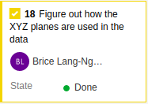
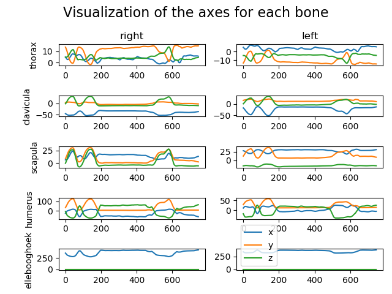

# Portfolio for Applied Data Science Minor

Welcome to the portfolio of Brice Lang-Nguyen,
 
This portfolio will describe all the activities that I did in the minor Applied Data science - KB74 (in the period from September 2019 to January 2020) at The Hague University of Applied Science.


     
In this minor, I worked in a team of 7 fellow students and one teacher on a research project for the LUMC.

# Table of Contents
- [1. Self-development](#1-self-development)
    - [1. Datacamp](#11-datacamp)
        - [1. Assessments](#111-assessments)
        - [2. Projects](#112-projects)
    - [2. Books](#12-books)
- [2. Project Management](#2-project-management)
    - [1. Azure DevOps](#21-azure-devops)
- [3. Project](#3-project)
    - [1. Introduction](#31-introduction)
        - [1. Dictionary](#311-dictionary)
            - [1. The 'Flock of Birds' system](#3111-the-flock-of-birds-system)
            - [2. Conversion made by the LUMC](#3112-conversion-made-by-the-lumc)
    - [2. Our research](#32-our-research)
        - [1. Figure out how the X,Y and Z planes are used in the data](#321-figure-out-how-the-xy-and-z-planes-are-used-in-the-data)
        - [2. Multiple exercises detection script](#322-multiple-exercises-detection-script)
        - [3. Split the data](#323-split-the-data)
        - [4. Convolutional neural network (CNN) - Data augmentation](#324-convolutional-neural-network-cnn---data-augmentation)
    - [3. Presentation](#33-presentations)
    
# 1. Self-development

## 1.1. Datacamp

At the begin of the 'Applied Data Science' course, we focused primarily on self-development, in particular self-development in the field of Python and machine learning by following the course of Datacamp. 
In the first weeks, 1 day a week was dedicated to the course on datacamp. Having already programmed in Python and having already used object-oriented programming with C++. I focused myself on learning the different libraries useful for learning machine learning (SKLearn and Tensorflow).

### 1.1.1. Assessments
      
**Here is the progress of the Datacamp courses:**


### 1.1.2. Projects

On Datacamp, you can find projects to train on machine learning techniques.  
I chose to do these projects to be able to improve my knowledge with the different libraries available with python like Pandas, Numpy, Matplotlib, etc.     
Most of them are focus on data manipulation and importing & cleaning data.   

**Here is the list of the Datacamp projects:**
- [Introduction to DataCamp Projects](./Datacamp/Projects/Introduction%20to%20DataCamp%20Projects/notebook.ipynb)
- [TV, Halftime Shows, and the Big Game](./Datacamp/Projects/TV,%20Halftime%20Shows,%20and%20the%20Big%20Game/notebook.ipynb)
- [The Github History of the Scala Language](./Datacamp/Projects/The%20GitHub%20History%20of%20the%20Scala%20Language/notebook.ipynb)
- [Exploring the Evolution of Linux](./Datacamp/Projects/Exploring%20the%20Evolution%20of%20Linux/notebook.ipynb)
- [Exploring 67 years of LEGO](./Datacamp/Projects/Exploring%2067%20years%20of%20LEGO/notebook.ipynb)

## 1.2. Books

/!\ Mettre que les livres on été proposer par tony & que j'ai lu que certains chapitre

-   
    *Introduction to Machine Learning with Python*  
    *Authors: Andreas C. Müller, Sarah Guido*
    
-   
    *Data Science from Scratch*   
    *Author: Joel Grus*
    
# 2. Project Management

To manage the project, we use the scrum method.    
So, every day we have to do a daily stand-up to inform everyone by answering these questions:
- What you did the day before?
- What you have planned to do, today?
- Do you need help?

## 2.1. Azure DevOps
We decided to use Azure DevOps because we can use the Azure's Scrum Board and use the Azure's repository together. So, we can follow which commit is link to which task.
Using Azure's scrum board, we could assign tasks to team members and track the progress of the tasks.

<details><summary>Here is a view of the scrum board (Click to show the picture) </summary>
  
</details>

<details><summary>Here is a view of the tasks for the Sprint 2 (from 17th September to 27th September) (Click to show the picture) </summary>
  
</details>

# 3. Project

## 3.1 Introduction

### 3.1.1 Dictionary

#### 3.1.1.1 The 'Flock of Birds' system

The 'Flock of Birds' system is a magnetic tracking system that allow to track the bones of one person.
This system output a file with the coordinates of each bone and their rotation matrix.   
Here is an example of the data:   


- The number in the black square is the sensor number.
- The numbers in the red square are the position matrix.
- The numbers in the blue square are the rotation matrix.

All the sensor of the 'Flock of Birds' system are put in specific part of the body.
For this project, 7 sensors are used to follow the different bones of the upper body.    
Here is the position of the 7 sensors used, represent by the dots:


In this project, there are also terms used by the medical field, which can be seen below.
  
© WJEC CBAC LTD 2016 - [Website link](http://resource.download.wjec.co.uk.s3.amazonaws.com/vtc/2015-16/15-16_30/eng/06-pivotal-kick/Unit6-analysis-of-movement.html)

For this project, we need to keep in mind that the 'left' and 'right' are always used from the perspective of the patient. This is independent of the plane of the view.
So the right arm is always the arm that the patient considers to be 'his right arm'.

### 3.1.1.2 Conversion made by the LUMC

The LUMC convert the output file of the 'Flock of Birds' system to a file that contain for each row the euler angles of each bones by following the Wu standard.
This standard is defined in the [Journal of Biomechanics 38 (2005) 981–992](./res/pdf/Wu%20et%20al%20J%20Biomech%2038%20(2005)%20981–992.pdf).

### 3.1.1.3 The Dataset

In this project, we used 3 types of data, here is there meaning:

| Term  | Meaning  |
|---|---|
| RAW Data | Data output by the 'Flock of Birds' system |
| Convert Data | Data after the conversion made by the LUMC |
| Cleaned Data | Data after the split of files that contains multiple times an exercise |

At the beginning of the project, we had access to the dataset of the previous group. But after a few weeks, during the first appointment at LUMC, a researcher gave us the RAW dataset and the converted dataset with euler angles. So, that we could reproduce the steps done by the previous research group.

All of this data (RAW, Convert and Cleaned) are organized by patient categories which include patients and their exercises.
```shell script
# This is the path for the first AB exercise of the patient 1 of Category 2
Category_2/1/AB1.csv
```

### 3.1.2 Project status at the beginning of the course

# 3.2 Our research

## 3.2.1 Figure out how the X,Y and Z planes are used in the data


## 3.2.2 Multiple exercises detection script

The Notebook can be found [here](./res/notebooks/Multiple%20Exercises%20Detection.ipynb)    
The script can be found [here](https://dev.azure.com/DataScienceMinor/_git/Data%20Science?path=%2FMutlipleExercisesDetectionV2.py)

## 3.2.3 Split the data

Visualizing converted data showed several recordings contained more than one exercise.
We wanted each file to contain only one times of an exercise and not several. This allows to have more exercises to train the model. 
This led to the creation of a cleaning method for the dataset.

We choose to split all the files that contains multiple times of one exercise.

To do this, I use the 3D Visualisation made by Raphaël.
##### Here is a gif of the visualization:


In order to complete this task, I made a useful visualization which is able to display the 3 euler axes for each bone.

##### Here are a few examples with the command use and the output of the script: 
```shell script
python VisualizeExercise.py -f file/path.csv
```


```shell script
python VisualizeExercise.py -f file/path.csv --lift 25
```


```shell script
python VisualizeExercise.py -f file/path.csv --separator=0,90,90,200,470,635
```


To complete this task, I performed these steps for each file in the dataset:
- Use the [3D Visualisation](#here-is-a-gif-of-the-visualization) of the raw file.
- Check how many times the movement is made:
    - If the movement is made more than 1 time:
        - Set the value of the column 'Contains multiple exercises' to 'YES'.
        - Use the [visualisation](#here-are-a-few-examples-with-the-command-use-and-the-output-of-the-script) of the euler axis to get the frame(s) where we need to split the file and note in the excel sheet.
    - If the movement is made 1 time:
        - Set the value of the column 'Contains multiple exercises' to 'NO'.
- If the file contains some anomalies like the sensor ground moving or that the sensors have only been placed on one side of the individual, then write the observations in the 'Annotations' column.
- Finally, set the column 'Check' to 'YES'. This is just to track where we are in the file check.

Here is the [result in Excel format](./res/sheet/Patients.xlsx).  
*Only the files of the AB, AF, EH, EL & RF exercises were checked

Before the split, we had:   

| Category no. | Number of exercises |
|--------------|---------------------|
| 1 | 298 |     
| 2 | 216 |
| 3 | 184 |
| 4 | 291 |


After the split, we had:    

| Category no. | Number of exercises |
|--------------|---------------------|
| 1 | 299 |
| 2 | 397 |
| 3 | 362 |
| 4 | 292 |

By splitting the files the number of exercises for categories 2 and 3 was almost doubled.

## 3.2.4 Convolutional neural network (CNN) - Data augmentation

In addition to validating the results of the previous group, we started looking for another technique of machine learning. We chose to explore what convolutional neural networks (CNN) could do with our dataset.

Hassane was working on that task and he was faced with a overfitting problem with his model.
He asked me to help him to implement some data augmentation techniques.
We chose to use data augmentation techniques to fix the overfitting issue because the dataset was too small to be use with a Convolutional neural network.

The goal of data augmentation is to increase the amount of data by using techniques like cropping, padding, flipping, etc.
Data augmentation makes the model more robust to slight variations, and hence prevents the model from overfitting.

Before implementing data augmentation in the project. I made a small script to understand how it's works and in what way we can implement those techniques.

The script can be found [here](./res/scripts/data_augmentation.py)          
The notebook can be found [here](./res/notebooks/Data%20Augmentation%20-%20CNN.ipynb)

Script results:
#### Original image:


#### Generated images:


Here is the code used for the CNN (Code extracted from the file [dataAug.py](./res/scripts/dataAug.py))
```python
def data_Augment(data_generator, images, limit=10):
    """
    Generates n image from an image by applying various transformations such as rotation, zoom, etc.
    :param data_generator: ImageDataGenerator
    :param limit: Number of images to generate
    :return: Array of picture
    """
    data_generator.fit(images)
    image_iterator = data_generator.flow(images)
    genarated_data = np.array([image_iterator.next()[0]])
    limit -= 1
    for image in image_iterator:
        # genarated_data = np.append((genarated_data, [image[0]]), axis=0)
        genarated_data = np.append(genarated_data, [image[0]], axis=0)
        limit -= 1
        if limit <= 0:
            break
    

    return genarated_data
```

## 3.3 Presentations

During each sprint we gave some presentations as a group, one every week. I myself made the following presentation with a team member:
- [Presentation week 14](./res/presentations/16-december.pptx)